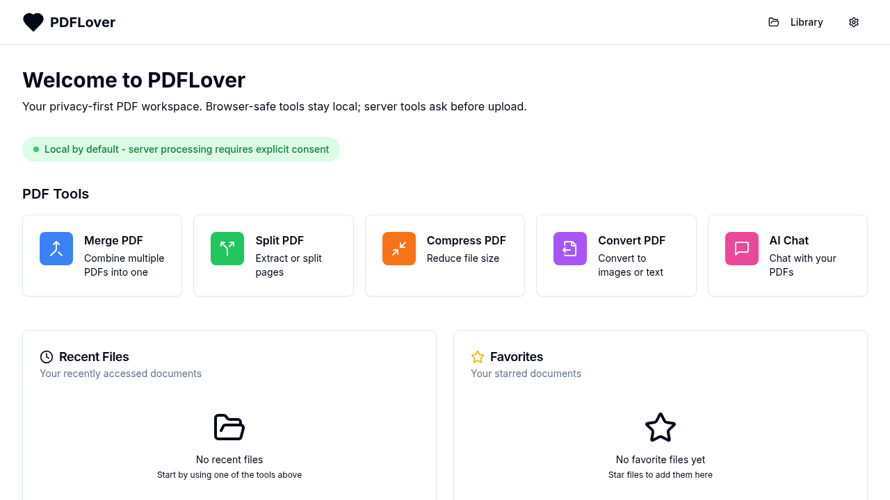

# PDFLover

Privacy-first PDF tools for the browser, with an optional server runtime for
operations that cannot be performed safely or reliably client-side.

PDFLover combines a local-first React application, reusable PDF processing
packages, and a bounded Fastify job API in one Bun/Turborepo workspace. Core
document workflows stay in the browser. System-engine operations and cloud AI
are available only through explicit, capability-aware server flows.



## Why PDFLover

- **Local-first by default.** Browser-safe transformations and the document
  library run on the user's device.
- **Explicit server boundary.** Uploads are limited to operations that require
  native tools, cryptographic material, expensive conversion, or a configured
  cloud credential.
- **No silent fallback.** Missing engines and failed transformations return
  typed errors instead of fabricated output or unchanged input.
- **Installable and offline-aware.** The frontend is a responsive PWA with
  IndexedDB persistence, update handling, and offline UI states.
- **One typed workspace.** The web app and API share operation, capability,
  job, artifact, and error contracts.

## Capabilities

| Area                  | Tools                                                                                                                                                     |
| --------------------- | --------------------------------------------------------------------------------------------------------------------------------------------------------- |
| Organize              | Merge, split, compress, and queue batch operations                                                                                                        |
| Edit and protect      | Annotate, crop, resize, trim, watermark, add headers and page numbers, sign, encrypt, decrypt, and securely redact                                        |
| Convert and extract   | Convert to images, text, and Office formats; extract images and tables; run OCR                                                                           |
| Review and understand | Search and overlay, compare documents, generate a table of contents, detect form fields, classify documents, extract key information, and chat with a PDF |
| Workspace             | Persistent browser library, operation history, settings, undo/redo, and global batch progress                                                             |

Most tools are browser-native. The API currently exposes server jobs for AES
encryption/decryption, secure redaction, PKCS#12 digital signing, searchable
OCR, DOCX/XLSX/PPTX conversion, and lossy compression. Cloud chat is available
only when the server has an OpenRouter key configured.

## Quick start

### Prerequisites

- [Bun](https://bun.sh/) 1.3.13
- A modern browser; WebGPU is recommended for local AI features
- Node.js 20 or newer when using Node-based auxiliary tooling

Native PDF engines are not required for browser-only development. The backend
container supplies its production engines; see [Server runtime](#server-runtime)
if you run the API directly on the host.

### Install and run

```bash
git clone https://github.com/novaDev315/pdf_lover.git
cd pdf_lover
cp .env.example .env
bun install --frozen-lockfile
bun run dev
```

The default development endpoints are:

- Web application: <http://localhost:5173>
- API: <http://localhost:8000>
- API readiness: <http://localhost:8000/api/v1/health/ready>

The root `dev` command starts workspace development tasks through Turborepo.
To run one application independently:

```bash
bun run --cwd apps/web dev
bun run --cwd apps/api dev
```

When starting applications separately, ensure the variables from `.env` are
present in both processes so the frontend API URL and backend CORS origin stay
aligned.

## Quality checks

Run the same root checks expected before shipping a change:

```bash
bun install --frozen-lockfile
bun run test
bun run lint
bun run typecheck
bun run build
```

Additional test workflows:

```bash
bun run test:watch          # interactive Vitest watch mode
bun run test:coverage       # coverage report
bun run test:web:production # production build plus browser route smoke test
```

The production web smoke test requires `playwright-cli`, or `npx` so the
Playwright CLI can be resolved on demand.

## Architecture

```text
pdf_lover/
├── apps/
│   ├── web/       React 19, Vite, PWA, browser storage, and PDF workspace
│   └── api/       Fastify job API, native engine adapters, and AI proxy
├── packages/
│   ├── pdf-core/  Browser-native PDF operations
│   └── shared/    Cross-runtime types, constants, and utilities
├── scripts/       Production verification helpers
├── docs/          Architecture and historical planning notes
├── homelab.yaml   Homelab build and deployment contract
└── turbo.json     Monorepo task graph
```

| Component            | Responsibility                                                                               | Primary technologies                                       |
| -------------------- | -------------------------------------------------------------------------------------------- | ---------------------------------------------------------- |
| `@pdflover/web`      | UI, browser PDF work, IndexedDB library, PWA behavior, typed API client                      | React, Vite, Tailwind CSS, Zustand, Dexie, PDF.js, pdf-lib |
| `@pdflover/api`      | Capability discovery, temporary jobs, engine isolation, artifact lifecycle, OpenRouter proxy | Bun, Fastify, qpdf, Tesseract, Poppler, Python             |
| `@pdflover/pdf-core` | Reusable browser-native PDF transformations                                                  | TypeScript, pdf-lib, PDF.js, Tesseract.js                  |
| `@pdflover/shared`   | Serializable contracts and shared utilities                                                  | TypeScript                                                 |

## Privacy and data lifecycle

Original documents and saved versions belong to browser IndexedDB. The server
does not provide a permanent document library.

When a user consents to a server operation:

1. The API validates the requested operation and current engine capability.
2. One PDF, plus a certificate when signing, is written beneath the configured
   temporary job root.
3. A bounded scheduler runs the native operation and validates its artifact.
4. The result is exposed as a checksummed, temporary download.
5. Inputs and artifacts are removed on cancellation, explicit deletion, or TTL
   expiry.

Jobs progress through:

```text
queued -> running -> succeeded | failed | cancelled -> expired
```

Do not commit `.env` files, OpenRouter keys, certificates, source documents, or
generated artifacts.

## Configuration

Copy `.env.example` for local development. Production secrets should be
injected by the runtime rather than stored in Git.

| Variable                       | Default                                   | Purpose                                                                |
| ------------------------------ | ----------------------------------------- | ---------------------------------------------------------------------- |
| `APP_ENV`                      | `development`                             | Runtime mode: `development`, `test`, or `production`                   |
| `BACKEND_HOST`                 | `0.0.0.0`                                 | API bind address                                                       |
| `BACKEND_PORT`                 | `8000`                                    | API port                                                               |
| `CORS_ORIGINS`                 | `http://localhost:5173`                   | Comma-separated allowed browser origins; `*` is rejected in production |
| `JOB_TEMP_ROOT`                | `/tmp/pdflover-jobs`                      | Temporary input and artifact directory                                 |
| `MAX_UPLOAD_BYTES`             | `104857600`                               | Maximum uploaded PDF size                                              |
| `ARTIFACT_TTL_SECONDS`         | `1800`                                    | Temporary artifact lifetime                                            |
| `JOB_CLEANUP_INTERVAL_SECONDS` | `60`                                      | Expired-job cleanup interval                                           |
| `GLOBAL_JOB_CONCURRENCY`       | `4`                                       | Maximum concurrent server jobs                                         |
| `CLIENT_JOB_CONCURRENCY`       | `2`                                       | Maximum concurrent jobs per client                                     |
| `PROCESS_TIMEOUT_SECONDS`      | `300`                                     | Native operation timeout                                               |
| `OPENROUTER_API_KEY`           | unset                                     | Enables the cloud AI proxy when provided                               |
| `OPENROUTER_TIMEOUT_SECONDS`   | `90`                                      | OpenRouter request timeout                                             |
| `VITE_API_BASE_URL`            | `http://localhost:8000` in `.env.example` | API origin embedded in the web build                                   |

The API exposes liveness, readiness, and runtime capability endpoints under
`/api/v1`. Clients should use `/api/v1/capabilities` as runtime truth instead
of assuming an operation is available.

## Server runtime

The production API image includes qpdf, Poppler, Tesseract language packs,
Python document libraries, and pyHanko. Building the image is the most
reproducible way to run every server capability:

```bash
docker build -f apps/api/Dockerfile -t pdflover-api .
docker run --rm \
  --env-file .env \
  -p 8000:8000 \
  pdflover-api
```

Build the static frontend with the public API origin embedded at build time:

```bash
docker build \
  -f apps/web/Dockerfile \
  --build-arg VITE_API_BASE_URL=http://localhost:8000 \
  -t pdflover-web .
docker run --rm -p 8080:8080 pdflover-web
```

The frontend container serves the SPA as an unprivileged nginx process and
publishes `/health` on port 8080.

## Deployment

`homelab.yaml` is the deployment contract for the Nova Homelab. It defines two
independent image services. The manifest declares deployment-facing ports;
each platform service maps those to the container port exposed by its image:

- Backend: manifest port `8003`, container port `8000`, readiness path
  `/api/v1/health/ready`
- Frontend: manifest port `8082`, container port `8080`, health path `/health`

Building, publishing, deploying, routing, or changing production secrets is an
operator action and is intentionally separate from the repository's build and
test commands.

## Development workflow

1. Create a focused branch from `main`.
2. Keep browser-native behavior in `apps/web` or `packages/pdf-core` unless the
   operation truly requires the server boundary.
3. Put cross-runtime contracts in `packages/shared`.
4. Add focused tests alongside the owning module.
5. Run the root quality checks before requesting review.

Historical planning documents remain under `docs/` for project context. The
current source, tests, and runtime capability endpoint are the authority for
implemented behavior.
