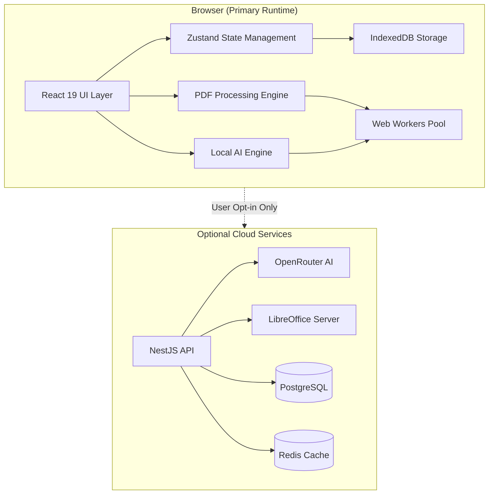
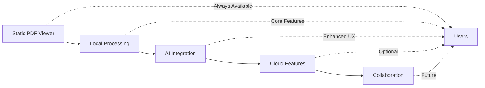

# PDFLover Technical Architecture

## System Architecture Overview

### Architecture Pattern: Local-First with Optional Cloud Enhancement



## Component Architecture (C4 Model)

### Level 1: System Context

```
Users --> PDFLover Web App --> Optional Cloud Services
                           --> Browser Storage (IndexedDB)
```

### Level 2: Container Architecture

```
┌──────────────────────────────────────────────────────────┐
│                    PDFLover System                        │
├────────────────────────────────────────────────────────────┤
│ ┌─────────────┐  ┌─────────────┐  ┌─────────────┐      │
│ │   Web App   │  │  Shared Lib │  │  PDF Core   │      │
│ │  (React 19) │  │   (@shared) │  │ (@pdf-core) │      │
│ └─────────────┘  └─────────────┘  └─────────────┘      │
│                                                          │
│ ┌─────────────┐  ┌─────────────┐  ┌─────────────┐      │
│ │   API       │  │  PostgreSQL │  │    Redis    │      │
│ │  (NestJS)   │  │  (Optional) │  │  (Optional) │      │
│ └─────────────┘  └─────────────┘  └─────────────┘      │
└──────────────────────────────────────────────────────────┘
```

### Level 3: Component Architecture

```typescript
// Frontend Component Hierarchy
interface ComponentArchitecture {
  pages: {
    Dashboard: Component;
    Editor: Component;
    Tools: Component;
    Settings: Component;
  };

  components: {
    layout: {
      AppShell: Component;
      Sidebar: Component;
      Header: Component;
      TabManager: Component;
    };

    pdf: {
      PdfViewer: Component;
      PageThumbnails: Component;
      AnnotationLayer: Component;
      EditToolbar: Component;
      ViewerControls: Component;
    };

    tools: {
      MergePanel: Component;
      SplitPanel: Component;
      ConvertPanel: Component;
      CompressPanel: Component;
      SecurityPanel: Component;
    };

    chat: {
      ChatPanel: Component;
      MessageList: Component;
      InputArea: Component;
      CitationViewer: Component;
    };
  };
}
```

## Data Flow Architecture

### State Management Pattern

```typescript
// Zustand Store Architecture
interface StoreArchitecture {
  // PDF Document Store
  pdfStore: {
    documents: Map<string, PDFDocument>;
    activeDocument: string | null;
    viewState: ViewState;
    annotations: Map<string, Annotation[]>;

    actions: {
      loadDocument: (file: File) => Promise<void>;
      updateAnnotations: (docId: string, annotations: Annotation[]) => void;
      saveDocument: () => Promise<Blob>;
    };
  };

  // File Management Store
  fileStore: {
    files: IndexedDBFile[];
    selectedFiles: string[];
    sortBy: SortCriteria;

    actions: {
      uploadFiles: (files: File[]) => Promise<void>;
      deleteFiles: (ids: string[]) => Promise<void>;
      searchFiles: (query: string) => Promise<IndexedDBFile[]>;
    };
  };

  // Chat Store
  chatStore: {
    conversations: Map<string, Conversation>;
    activeConversation: string | null;
    messages: Message[];

    actions: {
      sendMessage: (content: string) => Promise<void>;
      loadConversation: (docId: string) => Promise<void>;
      generateResponse: (context: string) => Promise<string>;
    };
  };

  // Settings Store
  settingsStore: {
    theme: 'light' | 'dark' | 'system';
    aiProvider: 'local' | 'openrouter';
    apiKeys: EncryptedKeys;
    preferences: UserPreferences;

    actions: {
      updateTheme: (theme: Theme) => void;
      saveApiKey: (provider: string, key: string) => Promise<void>;
    };
  };
}
```

### Processing Pipeline Architecture

```typescript
// PDF Processing Pipeline
interface ProcessingPipeline {
  // Input Stage
  input: {
    source: File | Blob | ArrayBuffer;
    validation: () => ValidationResult;
    preprocessing: () => Promise<ProcessedInput>;
  };

  // Processing Stage (in Web Worker)
  processing: {
    operation: 'merge' | 'split' | 'compress' | 'convert' | 'edit';
    executor: WorkerExecutor;
    progress: ProgressCallback;
    cancellation: AbortController;
  };

  // Output Stage
  output: {
    result: Blob | ArrayBuffer;
    metadata: ResultMetadata;
    storage: StorageStrategy;
    download: () => void;
  };
}

// Worker Pool Management
class WorkerPoolManager {
  private workers: Map<string, Worker>;
  private queue: TaskQueue;
  private maxWorkers: number = navigator.hardwareConcurrency || 4;

  async execute<T>(task: WorkerTask): Promise<T> {
    const worker = await this.getAvailableWorker();
    return this.runTask(worker, task);
  }
}
```

## Security Architecture

### Defense in Depth Strategy

```typescript
interface SecurityLayers {
  // Layer 1: Input Validation
  inputValidation: {
    fileTypeValidation: (file: File) => boolean;
    sizeLimit: number; // 200MB default
    malwareScanning: (buffer: ArrayBuffer) => Promise<ScanResult>;
  };

  // Layer 2: Processing Isolation
  processingIsolation: {
    webWorkerSandbox: boolean;
    memoryLimits: MemoryConstraints;
    timeoutProtection: number; // 30s default
  };

  // Layer 3: Data Protection
  dataProtection: {
    encryptionAtRest: boolean;
    encryptionInTransit: boolean;
    keyManagement: KeyManagementStrategy;
  };

  // Layer 4: Access Control
  accessControl: {
    documentPermissions: PermissionSet;
    featureFlags: FeatureFlags;
    apiRateLimiting: RateLimitConfig;
  };

  // Layer 5: Privacy Protection
  privacyProtection: {
    noTelemetry: boolean; // always true
    localProcessing: boolean; // default true
    dataRetention: RetentionPolicy;
    gdprCompliance: GDPRConfig;
  };
}
```

## Performance Architecture

### Optimization Strategies

```typescript
interface PerformanceOptimizations {
  // Rendering Optimizations
  rendering: {
    virtualScrolling: boolean;
    progressiveLoading: boolean;
    imageOptimization: ImageOptimizationConfig;
    canvasCaching: boolean;
  };

  // Processing Optimizations
  processing: {
    chunkedProcessing: ChunkConfig;
    streamingAPIs: boolean;
    sharedArrayBuffer: boolean;
    webAssembly: boolean;
  };

  // Network Optimizations
  network: {
    bundleSplitting: SplitConfig;
    lazyLoading: LazyLoadConfig;
    preloading: PreloadStrategy;
    compression: CompressionConfig;
  };

  // Storage Optimizations
  storage: {
    indexedDBSharding: boolean;
    compressionBeforeStore: boolean;
    cacheStrategy: CacheStrategy;
    quotaManagement: QuotaConfig;
  };
}
```

### Performance Budgets

```yaml
metrics:
  # Core Web Vitals
  LCP: < 2.5s  # Largest Contentful Paint
  FID: < 100ms # First Input Delay
  CLS: < 0.1   # Cumulative Layout Shift

  # Custom Metrics
  pdfLoadTime:
    small: < 1s    # < 1MB
    medium: < 2s   # 1-10MB
    large: < 5s    # 10-50MB

  operationTime:
    merge: < 3s
    split: < 2s
    compress: < 5s
    convert: < 4s

  aiResponseTime:
    firstToken: < 2s
    complete: < 10s
```

## AI Architecture

### Local AI Processing

```typescript
interface LocalAIArchitecture {
  // Model Management
  models: {
    embedding: {
      model: 'Xenova/all-MiniLM-L6-v2';
      size: '23MB';
      performance: 'real-time';
    };

    generation: {
      model: 'Xenova/Phi-3-mini-4k-instruct';
      size: '1.5GB';
      quantization: 'int8';
      performance: '2-5 tokens/sec';
    };
  };

  // Processing Pipeline
  pipeline: {
    textExtraction: PDFTextExtractor;
    chunking: TextChunker;
    embedding: EmbeddingGenerator;
    retrieval: VectorRetrieval;
    generation: ResponseGenerator;
  };

  // WebGPU Acceleration
  acceleration: {
    detection: () => boolean;
    fallback: 'cpu' | 'wasm';
    optimization: WebGPUOptimizationConfig;
  };
}
```

### Cloud AI Integration (Optional)

```typescript
interface CloudAIArchitecture {
  // OpenRouter Integration
  openRouter: {
    endpoint: 'https://openrouter.ai/api/v1';
    models: string[];
    streaming: boolean;
    fallback: LocalAIArchitecture;
  };

  // Request Management
  requestManagement: {
    rateLimiting: RateLimitConfig;
    retryStrategy: RetryConfig;
    errorHandling: ErrorHandler;
    costTracking: CostTracker;
  };
}
```

## Deployment Architecture

### Multi-Environment Strategy

```yaml
environments:
  # Development
  development:
    frontend:
      command: bun dev
      port: 5173
      hmr: true
    backend:
      command: bun run start:dev
      port: 3001
      debug: true
    services:
      postgres: docker
      redis: docker

  # Staging
  staging:
    frontend:
      build: bun run build
      serve: nginx
      cdn: cloudflare
    backend:
      build: docker build
      deploy: docker-compose
      scaling: manual
    monitoring:
      sentry: true
      analytics: false

  # Production
  production:
    frontend:
      build: bun run build:prod
      deploy:
        - cloudflare-pages
        - vercel
        - netlify
    backend:
      deploy:
        primary: static-only
        optional: docker-swarm
      scaling: auto
    cdn:
      provider: cloudflare
      cache: aggressive
```

### Infrastructure as Code

```typescript
// Docker Compose Configuration
interface DockerConfig {
  services: {
    web: {
      build: './apps/web';
      ports: ['3000:80'];
      volumes: ['./apps/web:/app'];
      environment: Environment;
    };

    api?: {
      build: './apps/api';
      ports: ['3001:3001'];
      depends_on: ['postgres', 'redis'];
      environment: Environment;
    };

    postgres?: {
      image: 'postgres:16-alpine';
      volumes: ['postgres_data:/var/lib/postgresql/data'];
      environment: DatabaseConfig;
    };

    redis?: {
      image: 'redis:7-alpine';
      volumes: ['redis_data:/data'];
      command: 'redis-server --appendonly yes';
    };
  };
}
```

## Monitoring & Observability

### Telemetry Architecture (Opt-in Only)

```typescript
interface ObservabilityStack {
  // Performance Monitoring
  performance: {
    webVitals: boolean;
    customMetrics: MetricDefinition[];
    sampling: SamplingConfig;
  };

  // Error Tracking
  errorTracking: {
    provider: 'sentry' | 'none';
    dsn?: string;
    environment: string;
    beforeSend: (event: ErrorEvent) => ErrorEvent | null;
  };

  // Logging
  logging: {
    level: 'error' | 'warn' | 'info' | 'debug';
    targets: LogTarget[];
    format: 'json' | 'text';
  };

  // Health Checks
  healthChecks: {
    endpoints: HealthEndpoint[];
    interval: number;
    timeout: number;
  };
}
```

## Testing Architecture

### Test Pyramid Strategy

```typescript
interface TestingArchitecture {
  // Unit Tests (70%)
  unit: {
    framework: 'vitest';
    coverage: {
      target: 80;
      enforced: true;
    };
    focus: [
      'PDF operations',
      'State management',
      'Utility functions',
      'Business logic'
    ];
  };

  // Integration Tests (20%)
  integration: {
    framework: 'vitest';
    targets: [
      'API endpoints',
      'Database operations',
      'Worker communication',
      'State persistence'
    ];
  };

  // E2E Tests (10%)
  e2e: {
    framework: 'playwright';
    scenarios: [
      'Complete PDF workflow',
      'File upload/download',
      'AI chat interaction',
      'Multi-tab operations'
    ];
  };

  // Performance Tests
  performance: {
    framework: 'lighthouse';
    budgets: PerformanceBudgets;
    continuous: boolean;
  };
}
```

## Migration Strategies

### Progressive Enhancement Path



## Technology Decision Records

### ADR-001: React 19 for UI Framework
**Status**: Accepted
**Context**: Need modern, performant UI framework
**Decision**: React 19 with Concurrent Features
**Consequences**: Better performance, newer APIs, potential stability issues

### ADR-002: Local-First Architecture
**Status**: Accepted
**Context**: Privacy and performance requirements
**Decision**: All core features run in browser
**Consequences**: Complex state management, large bundle size, excellent privacy

### ADR-003: Zustand for State Management
**Status**: Accepted
**Context**: Need simple, performant state management
**Decision**: Zustand over Redux/MobX
**Consequences**: Simpler API, smaller bundle, less boilerplate

### ADR-004: IndexedDB for Storage
**Status**: Accepted
**Context**: Need persistent browser storage
**Decision**: IndexedDB with Dexie.js wrapper
**Consequences**: Large storage capacity, async API, browser compatibility

### ADR-005: WebWorkers for Processing
**Status**: Accepted
**Context**: Heavy PDF processing blocks UI
**Decision**: Offload to Web Workers
**Consequences**: Better performance, complex communication, memory overhead

### ADR-006: Optional Backend Services
**Status**: Accepted
**Context**: Some features need server capabilities
**Decision**: Make backend completely optional
**Consequences**: Better privacy, complex feature detection, graceful degradation

## Success Metrics

```yaml
technical_metrics:
  performance:
    - First paint < 1s
    - Interactive < 3s
    - PDF render < 2s

  reliability:
    - 99.9% uptime (frontend)
    - < 0.1% error rate
    - Graceful degradation

  scalability:
    - Support 100MB PDFs
    - Handle 10 concurrent tabs
    - Process queue of 50 files

  security:
    - Zero data leaks
    - All local processing
    - E2E encryption for cloud

business_metrics:
  adoption:
    - 10,000 MAU in 6 months
    - 40% retention rate
    - 4.5+ star rating

  engagement:
    - 3+ operations per session
    - 10+ minutes per session
    - 20% use AI features
```

## Implementation Checklist

- [ ] Phase 1: Foundation (Week 1-2)
  - [ ] Monorepo setup with Turborepo
  - [ ] React 19 + Vite configuration
  - [ ] UI component library (shadcn)
  - [ ] Basic PDF viewer

- [ ] Phase 2: Core Features (Week 3-4)
  - [ ] PDF manipulation (merge, split)
  - [ ] Conversion utilities
  - [ ] Storage layer (IndexedDB)
  - [ ] Web Worker integration

- [ ] Phase 3: Advanced Features (Week 5-6)
  - [ ] Edit and annotation tools
  - [ ] Security features
  - [ ] AI chat integration
  - [ ] OCR capabilities

- [ ] Phase 4: Polish & Deploy (Week 7-8)
  - [ ] PWA configuration
  - [ ] Performance optimization
  - [ ] Testing suite
  - [ ] Production deployment